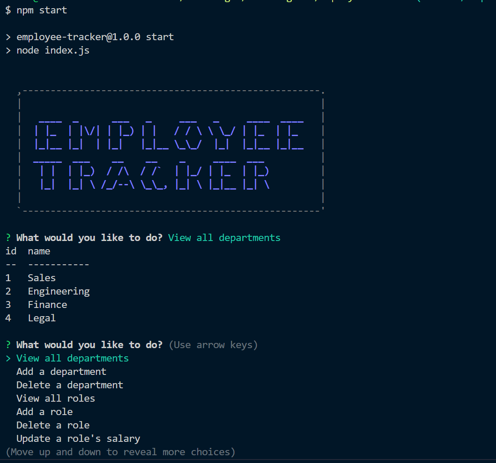

# Employee-Tracker


## Description
This application allows a business owner to organize and keep track of the departments, roles, and employees in their company. The user will answer questions in a command-line application to view, update, add, and delete information about their business from their MySQL database. The following were the requirements of the project:
* When the user starts the application, they are presented with (at least) the following options: view all departments, view all roles, view all employees, add a department, add a role, add an employee, and update an employee role.
* When the user chooses to view all departments, they are presented with a formatted table showing department names and department ids.
* When the user chooses to view all roles, they are presented with the job title, role id, the department that role belongs to, and the salary for that role.
* When the user chooses to view all employees, they are presented with a formatted table showing employee data, including employee ids, first names, last names, job titles, departments, salaries, and managers that the employees report to.
* When the user chooses to add a department, they are prompted to enter the name of the department and that department is added to the database.
* When the user chooses to add a role, they are prompted to enter the name, salary, and department for the role and that role is added to the database.
* When the user chooses to add an employee, they are prompted to enter the employee’s first name, last name, role, and manager, and that employee is added to the database.
* When the user chooses to update an employee role, they are prompted to select an employee to update and their new role and this information is updated in the database.

## Table of Contents
- [Installation](#installation)
- [Links](#links)
- [Usage](#usage)
- [License](#license)
- [How to Contribute](#how-to-contribute)
- [Questions](#questions)

## Installation
Visit the GitHub repository, Employee-Tracker (see the link below), to fork and clone the repository. The JSON file will have the necessary dependencies. Use:
````````````
npm install
````````````
The .gitignore file is set up in the root directory along with the index.js file that contains the code to run the command-line app. The lib folder contains the Department.js, Employees.js, and the Roles.js files, which contain the functions that run the databases queries for each corresponding MySQL table. The db folder contains the connection.js folder (for the user to enter their MySQL username and password), db.sql (the database MySQL queries), schema.sql (the table MySQL queries), and seeds.sql (the queries to populate the tables in MySQL). The user will need to create a .env file and use the code described in the Usage section to login to their MySQL account and run the application. They will need to add .env to their .gitignore file so that their password is not pushed to GitHub.

## Links
- [GitHub Repository](https://github.com/amklenk/Employee-Tracker)
- [Walkthrough Video 1 Link for Startup and View Functionality](https://drive.google.com/file/d/1RvlynB89ok4dxtSfxp5KxtMXsjE_pAxG/view?usp=sharing)
- [Walkthrough Video 2 Link for Add/Delete Functionality](https://drive.google.com/file/d/1hAKKsH1StMlCx1Mrzv7p-BE2-xyMUnaF/view?usp=sharing)
- [Walkthrough Video 3 Link for Update/Quit Functionality](https://drive.google.com/file/d/1olJDpmPaTZe6e9g4VSKCuM27hN8qcf8Z/view?usp=sharing)

## Usage
The following image is a screenshot of the command-line application, Employee Tracker.

CLI App



Before navigating the application, the user needs to create a .env file in their root directory to connect to their local MySQL database. They will need to put the following code in their .env file:

``````````````````````````````
DB_PASSWORD="userpasswordhere"
DB_DATABASE="business"
``````````````````````````````

 The application is navigable via opening the index.js file in an integrated terminal. To run the application, the user should type
`````````````
node index.js
`````````````
OR
``````````
npm start
``````````
into the terminal. All of the user data is entered using Inquirer prompts. The user will receive their data in tables or a message to let them know how they changed the database in the terminal.

## License
The badge at the top of the page shows that this project is licensed under MIT. The link for that license is shown below.
- [License: MIT](https://opensource.org/licenses/MIT)
## How to Contribute
Please fork and clone the repository and use a pull request to add or make changes to the current repository.

## Questions
Please direct any questions to amandamklenk3@gmail.com. To see more projects, visit the link below for amklenk's respository:
- [GitHub Repository](https://github.com/amklenk)
